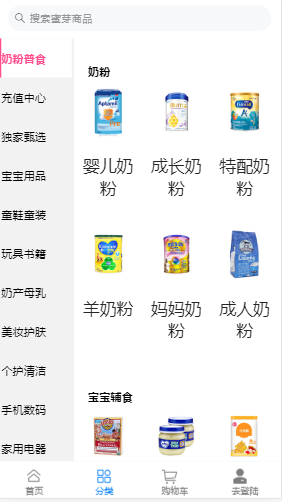

# 项目分工说明

## 项目名称：==蜜芽网==

## 项目目录说明

* **首页，详情页，列表页，购物车，登录注册，用户信息**

* 移动端页面**github**地址：https://github.com/gzh51906/mia
* 后端管理系统**github**地址：https://github.com/gzh51906/mia2
*  上线地址：http://47.104.103.240:1906
*  官网：https://m.mia.com/

## 团队成员

* 组长：陈家浩，组员：蔡莹，罗诗华，刘钦博

* ### 负责模块

* 陈家浩：**首页，用户信息** 

* ==蔡莹==：**详情页，列表页，分类模块** 

* ==罗诗华==：**后端管理系统，前端页面逻辑，购物车，登录注册，....** 

* ==刘钦博==：**后端管理系统** 
## 项目页面截图
 
 
 
 
##项目目录说明

webApp的tree

|-- README.md
|-- babel.config.js
|-- package-lock.json
|-- package.json
|-- public
|   |-- favicon.ico
|   |-- homeImg
|   |   |-- app.jpg
|   |   |-- bgicon.png
|   |   |-- icon2.png
|   |   |-- img1.jpg
|   |   |-- img2.jpg
|   |   |-- img3.jpg
|   |   |-- img4.jpg
|   |   |-- img5.jpg
|   |   |-- m_title2.png
|   |   |-- miyaicon.png
|   |   |-- search.png
|   |   `-- \317\336\312\261\303\353\311\261.png
|   |-- img
|   |   |-- download.jpg
|   |   |-- icoDomain_01.jpg
|   |   |-- icoDomain_02.jpg
|   |   |-- icoDomain_03.jpg
|   |   |-- icoDomain_04.png
|   |   |-- icon_01.png
|   |   |-- icon_02.png
|   |   |-- icon_03.png
|   |   |-- icon_04.png
|   |   `-- icon_05.png
|   `-- index.html
`-- src
    |-- App.vue
    |-- assets
    |   `-- logo.png
    |-- components
    |   `-- HelloWorld.vue
    |-- main.js
    |-- router.js
    |-- store.js
    `-- views
        |-- Detail.vue
        |-- List.vue
        |-- Login.vue
        |-- Mine.vue
        |-- Reg.vue
        |-- Tabbar
        |   |-- Cart.vue
        |   |-- Classify.vue
        |   |-- Home.vue
        |   `-- t1.html
        `-- Tabbar.vue

